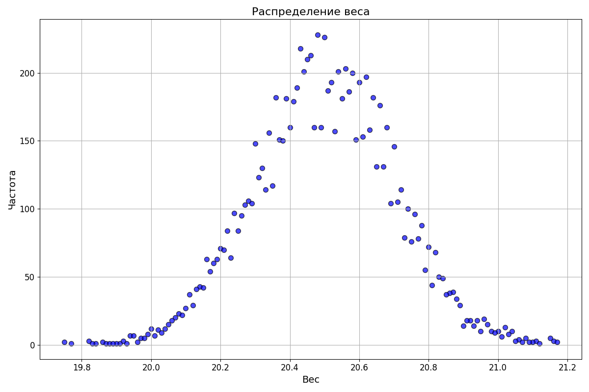

# Анализ данных о весе Raspberry Pi

## Описание
Этот проект предназначен для анализа данных о весе устройств Raspberry Pi. Программа загружает данные из CSV-файла, проводит их предварительную обработку, анализирует и визуализирует результаты анализа. Целью проекта является предоставление статистического анализа веса устройств, включая средний вес, медиану, стандартное отклонение, а также визуализацию распределения веса устройств.

## Функционал
- Загрузка и предварительная обработка данных из CSV-файла.
- Округление значений веса до двух десятичных знаков.
- Расчет разницы в весе относительно заданного значения.
- Статистический анализ округленных значений веса.
- Визуализация распределения веса устройств.

## Зависимости
Для работы программы необходимы следующие библиотеки:
- `pandas`
- `matplotlib`

## Установка и запуск проекта
1. Клонируйте репозиторий:
```
git clone https://github.com/Sogato/BDA-lab4.git
```
2. Создайте виртуальное окружение:
```
python -m venv env
```
3. Установите зависимости проекта:
```
pip install -r requirements.txt
```
4. Запустите программу:
```
python main.py
```


## Пример использования
После запуска программы вы увидите в консоли статистический анализ данных, а также в директории проекта будут сохранены следующие файлы:
- `weight_distribution.png` — изображение, показывающее распределение веса устройств.

## Визуализация результатов

### Распределение веса устройств


Этот график показывает распределение веса устройств Raspberry Pi. Каждая точка на графике соответствует частоте встречаемости определенного веса устройства в анализируемых данных.

---

Подготовлено в рамках учебного проекта. Все данные взяты из открытых источников и использованы исключительно в образовательных целях.

---

## Контрольные вопросы

### 1. Какие статистические значения для датафрейма позволяет получить метод `describe()`?

Метод `describe()` предоставляет следующие статистические значения для числовых столбцов датафрейма:

- `count` - количество непустых (не NaN) значений.
- `mean` - среднее значение.
- `std` - стандартное отклонение, показывающее разброс данных относительно среднего значения.
- `min` - минимальное значение.
- Квартили `25%`, `50%` (медиана), и `75%` - значения, разделяющие выборку данных на четыре равные части.
- `max` - максимальное значение.

Для нечисловых столбцов (например, строковых или категориальных данных) `describe()` по умолчанию возвращает другие статистические значения, такие как количество, количество уникальных значений, самое частое значение и частоту самого частого значения.
### 2. Как добавить в датафрейм новый столбец с данными?

Для добавления нового столбца в датафрейм можно использовать простое присваивание. Следует указать имя нового столбца и присвоить ему значения. Например, если мы хотим добавить в датафрейм `df` новый столбец с именем `new_column`, содержащий данные, мы можем сделать это следующим образом:

```python
df['new_column'] = данные_для_столбца
```
`данные_для_столбца` могут быть списком, массивом, серией или любым другим итерируемым объектом, размер которого соответствует количеству строк в датафрейме. Также можно использовать выражения для генерации данных на основе значений в других столбцах датафрейма:

### 3. Что такое частотное распределение данных?

Частотное распределение данных - это способ представления данных, который показывает, как часто встречается каждое уникальное значение в наборе данных. Оно позволяет оценить распределение и тенденции в данных, выявляя наиболее и наименее часто встречающиеся значения.

Частотное распределение может быть представлено в виде таблицы, гистограммы или графика, где:

- Каждое уникальное значение (или группа значений, если данные группируются) отображается на оси X.
- Частота, с которой каждое значение встречается в наборе данных, отображается на оси Y.

Таблица частотного распределения содержит два столбца: первый для уникальных значений (или групп значений) и второй для соответствующих частот. Гистограмма или график частотного распределения визуализируют эту информацию, позволяя легко увидеть наиболее частые и редкие значения в данных.

### 4. Что делает функция `to_frame()`, почему необходимо преобразовать серию данных в датафрейм?

Функция `to_frame()` в Pandas используется для преобразования объекта `Series` в объект `DataFrame`. Серия в Pandas представляет собой одномерный массив с осью индексов, который можно рассматривать как один столбец данных. Когда аналитики работают с данными, часто возникает необходимость в преобразовании серии в датафрейм для удобства работы, добавления новых столбцов, слияния с другими датафреймами или для более сложного анализа и обработки данных.

Преобразование серии в датафрейм позволяет:

- **Расширить структуру данных**: Превращение серии в датафрейм облегчает добавление дополнительных столбцов данных, что невозможно с одномерной серией.
- **Упростить анализ и визуализацию**: Многие функции анализа данных и визуализации оптимизированы для работы с датафреймами, так как они могут содержать множество разнотипных данных.
- **Облегчить слияние и объединение данных**: Датафреймы можно легко объединять и сливать по индексам или ключевым столбцам, что делает структуру данных датафрейма предпочтительной для комплексных операций с данными.

### 5. Как при выводе значения переменной в текстовой строке оставить только 2 цифры после десятичной точки, если исходное значение содержит больше цифр?
В Python для форматирования чисел с определенным количеством знаков после десятичной точки используют метод форматирования строк format() или f-строки (f-strings). Ниже приведены примеры обоих методов:

Используя метод format():
```python
number = 3.14159265359
formatted_number = "{:.2f}".format(number)
print(formatted_number)  # Выводит: 3.14
```
Используя f-строки (доступно начиная с Python 3.6):
```python
number = 3.14159265359
formatted_number = f"{number:.2f}"
print(formatted_number)  # Выводит: 3.14
```
Оба этих метода обрезают число до двух знаков после десятичной точки.
